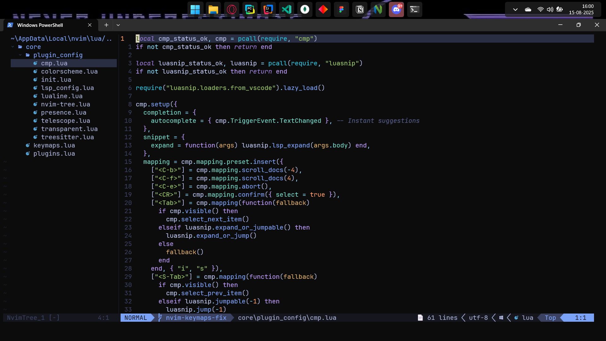

# Neovim Configuration for windows - Tokyo Night Setup



A **full-featured Neovim configuration** featuring the **Tokyo Night theme**, optimized for productivity, coding, and modern development workflows. This setup includes LSP, Treesitter, autocompletion, file navigation, and even Jupyter-like notebook support.

---

## Features

### Theme & Appearance
- **Tokyo Night** theme with optional **Gruvbox** alternative.
- **Lualine** statusline with icons and custom sections.
- Customizable colors and theme settings in `lua/core/settings.lua`.
- **Icons** support with `nvim-web-devicons`.

### File Navigation & Search
- **Nvim Tree** file explorer.
- **Telescope.nvim** for fuzzy file search, buffers, git files, and more.

### Code Editing & Productivity
- **Treesitter** for syntax highlighting and text objects.
- **Which-key.nvim** to discover keybindings quickly.
- **Presence.nvim** for Discord Rich Presence integration.
- **Snippets** with LuaSnip and Friendly Snippets.
- **Jupyter/Notebook support** with `magma-nvim`.

### LSP & Autocompletion
- **Mason.nvim** to install and manage LSP/DAP/linters easily.
- **nvim-lspconfig** for configuring language servers.
- **nvim-cmp** for autocompletion with LuaSnip snippet integration.

### Other Utilities
- **Plenary.nvim** and **Popup.nvim** for Lua helper functions.
- Automatically installs **Packer.nvim** if not present.
---

## Folder Structure

~/.config/nvim/
├── init.lua               # Main configuration entrypoint
├── image.png              # Screenshot for README
└── lua/
    └── core/
        ├── keymaps.lua           # Custom keybindings
        ├── settings.lua          # Theme and global options
        └── plugin_config/
            └── init.lua          # Packer plugin setup

---

## Plugins Used (with descriptions)

| Plugin | Description |
|--------|-------------|
| `wbthomason/packer.nvim` | Plugin manager |
| `folke/tokyonight.nvim` | Tokyo Night theme |
| `ellisonleao/gruvbox.nvim` | Alternative color scheme |
| `nvim-treesitter/nvim-treesitter` | Syntax highlighting & text objects |
| `folke/which-key.nvim` | Displays available keybindings |
| `nvim-tree/nvim-tree.lua` | File explorer |
| `nvim-tree/nvim-web-devicons` | File icons support |
| `williamboman/mason.nvim` | LSP/DAP/Linter installer |
| `williamboman/mason-lspconfig.nvim` | Mason + LSP integration |
| `neovim/nvim-lspconfig` | Language server configuration |
| `nvim-lualine/lualine.nvim` | Statusline |
| `andweeb/presence.nvim` | Discord Rich Presence |
| `hrsh7th/nvim-cmp` | Autocompletion engine |
| `hrsh7th/cmp-nvim-lsp` | LSP completion source |
| `hrsh7th/cmp-buffer` | Buffer completion source |
| `hrsh7th/cmp-path` | Path completion source |
| `L3MON4D3/LuaSnip` | Snippet engine |
| `saadparwaiz1/cmp_luasnip` | LuaSnip source for cmp |
| `rafamadriz/friendly-snippets` | Predefined snippets |
| `nvim-telescope/telescope.nvim` | Fuzzy finder |
| `dccsillag/magma-nvim` | Jupyter notebook support |

---

## Installation (Windows)

1. **Clone Repository**

```powershell
git clone https://github.com/Obiwankenobi699/nvim_Config_4Everyone.git $Env:USERPROFILE\.config\nvim


==============================
NEOVIM TOKYO NIGHT SETUP GUIDE
==============================

This guide will help you quickly set up the Neovim configuration with the Tokyo Night theme on Windows.

--------------------------------------------------
1. PREREQUISITES
--------------------------------------------------
Make sure you have the following installed:

1. Neovim (v0.8+ recommended) - https://neovim.io/
2. Git - https://git-scm.com/
3. PowerShell Core or Windows Terminal (optional, recommended)
4. (Optional) WezTerm terminal for a better experience - https://wezfurlong.org/wezterm/

--------------------------------------------------
2. CLONE THE CONFIGURATION
--------------------------------------------------
Open PowerShell or your terminal and run:

git clone https://github.com/Obiwankenobi699/nvim_Config_4Everyone.git $Env:USERPROFILE\.config\nvim

This will copy the configuration to the default Neovim folder.

--------------------------------------------------
3. START NEOVIM
--------------------------------------------------
- Open Neovim by typing `nvim` in your terminal.
- On first launch, Packer.nvim (plugin manager) will automatically install itself and the plugins.

--------------------------------------------------
4. INSTALL PLUGINS MANUALLY (IF NEEDED)
--------------------------------------------------
If plugins did not install automatically, run inside Neovim:

:PackerSync

--------------------------------------------------
5. CHANGE THEME
--------------------------------------------------
- Open `lua/core/settings.lua`
- Set your preferred theme:

vim.cmd("colorscheme tokyonight")  -- Options: tokyonight, gruvbox

--------------------------------------------------
6. CUSTOM KEYBINDINGS
--------------------------------------------------
- Open `lua/core/keymaps.lua`
- Add your custom keymaps. Example:

vim.api.nvim_set_keymap('n', '<leader>ff', ':Telescope find_files<CR>', { noremap = true, silent = true })

--------------------------------------------------
7. ADD OR REMOVE PLUGINS
--------------------------------------------------
- Open `lua/core/plugin_config/init.lua`
- Add or remove plugins as needed.
- Run `:PackerSync` inside Neovim to update plugins.

--------------------------------------------------
8. LSP AND AUTOCOMPLETION
--------------------------------------------------
- Install language servers using Mason:

:Mason

- Autocompletion is powered by nvim-cmp with LuaSnip support.
- Snippets are preloaded from `rafamadriz/friendly-snippets`.

--------------------------------------------------
9. NOTEBOOK CELLS (JUPYTER LIKE)
--------------------------------------------------
- Magma.nvim allows execution of code cells directly in Neovim.
- Initialize Magma:

:MagmaInit

- Select code and run `:MagmaEvaluate` to execute.

--------------------------------------------------
10. HELPFUL TIPS
--------------------------------------------------
- Show line numbers:

vim.api.nvim_set_option('number', true)

- Discover keybindings quickly:

:WhichKey

- Update all plugins:

:PackerSync

- Explore files quickly:

<Telescope> (example keymap: <leader>ff)

- Open file explorer:

<NvimTreeToggle> (example keymap: <leader>fn)

--------------------------------------------------
11. FOLDER STRUCTURE
--------------------------------------------------
~/.config/nvim/
├── init.lua               # Main entry point
├── image.png              # Screenshot for README
└── lua/
    └── core/
        ├── keymaps.lua           # Custom keybindings
        ├── settings.lua          # Theme & options
        └── plugin_config/
            └── init.lua          # Plugin definitions

--------------------------------------------------
12. TROUBLESHOOTING
--------------------------------------------------
- Plugins not loading? Run `:PackerSync`.
- LSP not working? Make sure servers are installed via Mason.
- Keybindings not working? Check `keymaps.lua` syntax.
- Theme not applied? Check `settings.lua` for colorscheme.

--------------------------------------------------
13. RESOURCES
--------------------------------------------------
- Neovim: https://neovim.io/
- Packer.nvim: https://github.com/wbthomason/packer.nvim
- Tokyo Night Theme: https://github.com/folke/tokyonight.nvim
- Mason.nvim (LSP installer): https://github.com/williamboman/mason.nvim
- Magma.nvim (Jupyter support): https://github.com/dccsillag/magma-nvim
- Telescope.nvim (Fuzzy finder): https://github.com/nvim-telescope/telescope.nvim

==============================
ENJOY YOUR NEOVIM SETUP!
==============================

